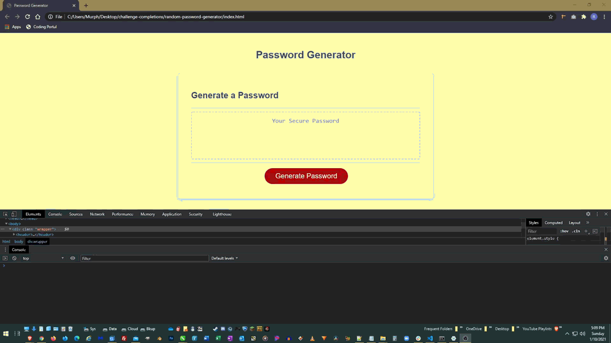

# Random Password Generator

## Description

This repo contains a javaScript random password generator that takes into account user designated password length, lowercase character acceptance, uppercase character acceptance, number acceptance, and/or special character acceptance. This password is generated on a button click and then output to the users screen.

 

* Prompts the user for a password length of values between 8 and 128
* Prompts the user for character type acceptance
* Calculates a random password based on length and character type criteria established above
* Outputs the generated password on the users screen

 

This random password generator is intended to generate strong and unique passwords for various applications.

 

Dealing with the "NaN" outputs from non parsable prompts proved to be a headache. Seems the solution was to use the isNan() function to filter out NaN results. Version 1 of this logic was extremely bloated with lots of repetition. During the version 2 consolidation, I had many logical structure "eureka" moments as well.

 

[Random Password Generator](https://rickhill543.github.io/random-password-generator/)

***

## Installation

N/A

***

## Usage

For generating a random password of custom length with custom character type criteria.

 

***

## Credits

W3Schools for always being there | 
[W3Schools](https://www.w3schools.com/)

 

***

## License

All Rights Reserved.